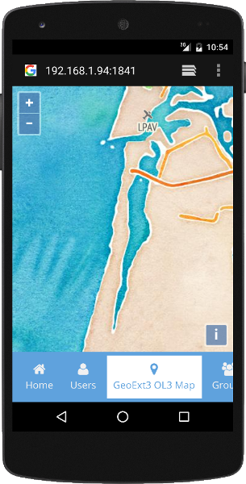

# GeoExt 3 Universal App

Follow these instructions to build your first GeoExt 3 application, using Sencha cmd. These instructions were prepared using:

* Sencha Cmd v6.0.1.76
* ExtJs GPL 6.0.0 (ext.version.number=6.0.0.640)
* GeoExt 3 (from 2015-10-03)

We will create a basic GeoExt 3 based universal app. A universal app should use both the classic and modern toolkit to work on desktop and mobile browsers. At the end of this exercise, you should have an application displaying a OL3 map on a panel, both on the desktop and mobile browser.

## ExtJS Universal App

Let's review the Sencha cmd used to create a basic universal app.

Installing [Sencha Cmd](https://www.sencha.com/products/extjs/cmd-download/)

Download ExtJs 6 GPL ([version ext-6.0.0](https://www.sencha.com/legal/gpl/)). Unzip it, and store it somewhere on your file system, like `/somewhere/ExtJs 6/ext-6.0.0/`

To create a universal ExtJs 6 based app, do:

```
sencha -sdk "/somewhere/ExtJs 6/ext-6.0.0/" generate app MyApp MyApp
cd MyApp
sencha app watch
```

## Preview the ExtJS Universal App

The last sencha command `sencha app watch` will start a service at port 1841 to serve your application.

```
(...)
[INF] Application available at http://localhost:1841
[INF] Waiting for changes...
```

When you see `Waiting for changes...`, open the browser using [http://localhost:1841/](http://localhost:1841/) or [http://localhost:1841/?profile=modern](http://localhost:1841/?profile=modern) to see the mobile enabled version.

## GeoExt 3 Universal App

Let's do it! Please make sure that you are able to create the ExtJS Universal App as described. The process to create our first GeoExt 3 is quite similar.

You already have Sencha cmd and Sencha 6. Let's start with a basic ExtJS application.

```
sencha -sdk "/somewhere/ExtJs 6/ext-6.0.0/" generate app MyGeoExtApp MyGeoExtApp
cd MyGeoExtApp/
sencha app watch
```

When you see `Waiting for changes...`, open the browser using [http://localhost:1841/](http://localhost:1841/) and [http://localhost:1841/?profile=modern](http://localhost:1841/?profile=modern) to make sure the basic app is running.

If the application is running properly, you can stop the web server with `^C` and move on.

### Install GeoExt 3 package

GeoExt 3 was developed as a ExtJS [package](http://docs.sencha.com/cmd/6.x/cmd_packages/cmd_packages.html). Install the `GeoExt3` package, using sencha cmd.

```
sencha package repo add GeoExt http://geoext.github.io/geoext3/cmd/pkgs
```

Sencha cmd can be used to check that that GeoExt repository was added.

```
sencha repository list
```

You should get something like:

```
Sencha Cmd v6.0.1.76
[INF] Remote repository connections (3):
[INF] 
[INF]     sencha - http://cdn.sencha.com/cmd/packages/
[INF]     GeoExt - http://geoext.github.io/geoext3/cmd/pkgs/
```

### Adding a new view

We need a new view to display a map. Use the following Sencha cmd to create a default view.

```
sencha generate view main.Map
```

This creates 3 new files, under `app/view/main/`. None is created under `classic/src/view/main/` or `modern/src/view/main/`.

```
app/view/main/Map.js
app/view/main/MapController.js
app/view/main/MapModel.js
```

### Changing the new view, to extend GeoExt.component.Map

We need to change the view created by `sencha generate view main.Map`. 

Three modifications are necessary. The view should extend `GeoExt.component.Map`, have an xtype `mappanel` assigned for future reference and needs an additional property `map`.

The entire 'app/view/main/Map.js' is:

```
Ext.define("MyGeoExtApp.view.main.Map",{
    extend: "GeoExt.component.Map",
    xtype: 'mappanel',
    requires: [
        "MyGeoExtApp.view.main.MapController",
        "MyGeoExtApp.view.main.MapModel"
    ],
    controller: "main-map",
    viewModel: {
        type: "main-map"
    },
    map: new ol.Map({
        layers: [
            new ol.layer.Tile({
                source: new ol.source.Stamen({
                    layer: 'watercolor'
                })
            }),
            new ol.layer.Tile({
                source: new ol.source.Stamen({
                    layer: 'terrain-labels'
                })
            })
        ],
        view: new ol.View({
            center: ol.proj.fromLonLat( [-8.751278, 40.611368] ),
            zoom: 12
        })
    })
});
```

### Include the new view in the existing tab panel

The base application display a tab panel, both on the classic and modern based toolkit.

To display our new map, we need to change both `classic/src/view/main/Main.js` and `modern/src/view/main/Main.js`.

Add a new tab to `classic/src/view/main/Main.js`:

```
{
        title: 'GeoExt3 OL3 Map',
        iconCls: 'fa-map-marker',
        layout: 'fit',
        items: [{
            xtype: 'mappanel'
        }]
},
```

Add a new tab to `modern/src/view/main/Main.js`:

```
{
        title: 'GeoExt3 OL3 Map',
        iconCls: 'x-fa fa-map-marker',
        layout: 'fit',
        items: [{
            xtype: 'mappanel'
        }]
},
```

### Adjust app.json

The file `app.json` must be adjusted before we can build the application.

Two small changes are necessary.

Add the following GeoExt 3 paths to `classpath`:

```
    "classpath": [
        "app",
        "${toolkit.name}/src",
        "packages/remote/GeoExt/src/component",
        "packages/remote/GeoExt/src/data",
        "packages/remote/GeoExt/src/mixin"
    ],
```

Change the ```builds``` section, adding `requires`:

```
    "builds": {
        "classic": {
            "toolkit": "classic",
            "theme": "theme-triton",
            "sass": {
                // "save": "classic/sass/save.scss"
            },
            "requires": [
                "GeoExt"
            ]
        },
        "modern": {
            "toolkit": "modern",
            "theme": "theme-triton",
            "sass": {
                // "save": "modern/sass/save.scss"
            }
        }
    },
```

Note: Do not change the global `requires`:

```
    "requires": [
        "font-awesome"
        // "GeoExt" // not here, put it under builds/classic/requires
    ],
```
### Add OpenLayers library to index.html

Edit `index.html`, to include the OpenLayers library. Add these two lines, after the existing `<title>MyGeoExtApp</title>`.

```
    <link rel="stylesheet" type="text/css" href="http://openlayers.org/en/master/css/ol.css">
    <script src="http://openlayers.org/en/master/build/ol.js"></script>
```

### Build and test the app

Start by doing:

```
sencha app refresh
```

Since we need the GeoExt package (added to the "requires" in `app.json`), the previous command will download the package and installs it under `packages/remote/GeoExt`.
Make sure you have this folder added to your local application.

If everything went fine, you can start the application with:

```
sencha app watch
```

Open the browser using [http://localhost:1841/](http://localhost:1841/) and [http://localhost:1841/?profile=modern](http://localhost:1841/?profile=modern) to test the app.

The following screenshots shows the result, for the classic (running on desktop browser) and modern toolkit (running on mobile).

 



### Celebrate and share

Congratulations! Celebrate and share your accomplishment!

### Further development

You can add more and more components to the newly created application, but keep in mind that some GeoExt 3 components might not able to run properly on both toolkits (classic and modern).

Check [GeoExt 3 Issue #65](https://github.com/geoext/geoext3/issues/65) for further details.